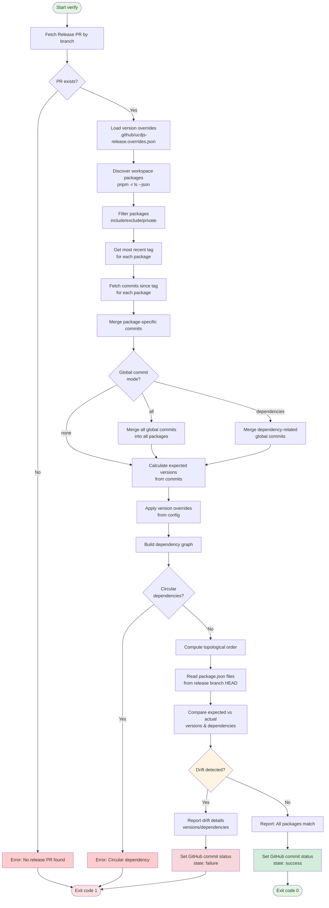
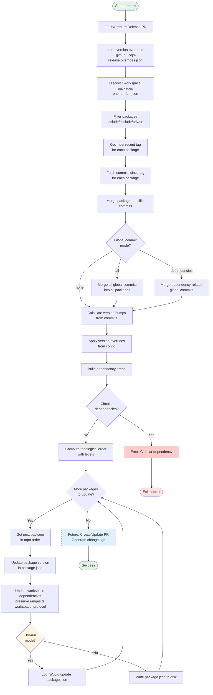
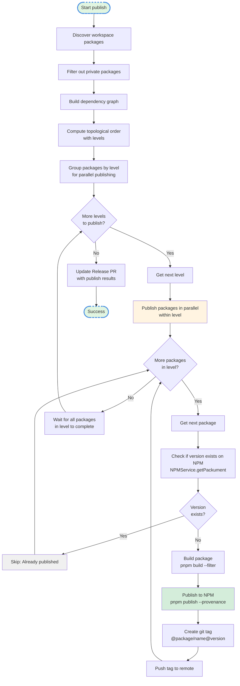
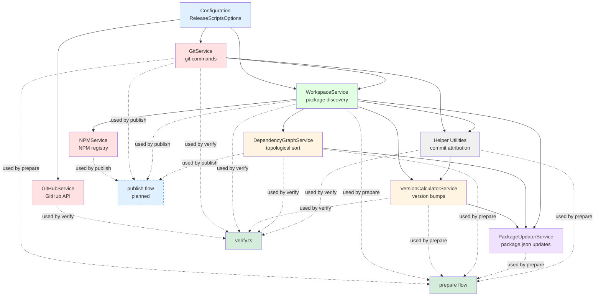
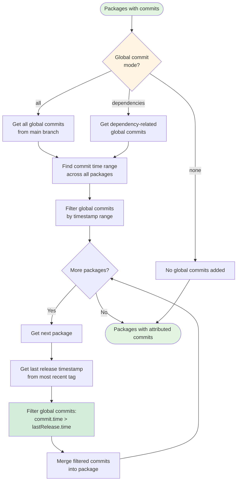
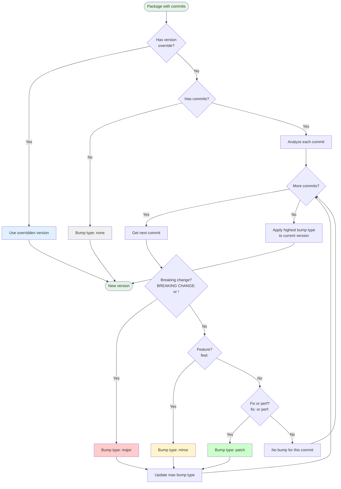

# AGENTS.md - Release Scripts Architecture Guide

## Project Overview

**@ucdjs/release-scripts** is a sophisticated monorepo release automation library built on Effect-TS. It provides programmatic tools for managing releases in pnpm workspaces with automated version calculation, dependency graph resolution, and GitHub integration.

### Key Features

- **Automated Version Calculation**: Analyzes git commits using conventional commit standards to determine appropriate version bumps (major, minor, patch)
- **Workspace Management**: Discovers and manages multiple packages in pnpm workspaces
- **Dependency Graph Resolution**: Computes topological ordering for package releases based on workspace dependencies
- **GitHub Integration**: Creates and manages release pull requests, sets commit statuses
- **Release Verification**: Validates that release branches match expected release artifacts
- **Dry-Run Support**: Allows testing release workflows without making actual changes

### Current Status

Version: `v0.1.0-beta.24`

Implemented workflows:
- ✅ `verify()` - Release branch verification
- ✅ `prepare()` - Release preparation with version updates
- ⏳ `publish()` - NPM publishing (planned)

## Architecture

### Effect-TS Functional Architecture

The codebase uses **Effect-TS** as its foundational architecture, providing:

#### Service Pattern
All services extend `Effect.Service` with dependency injection:

```typescript
export class ServiceName extends Effect.Service<ServiceName>()(
  "service-identifier",
  { effect: Effect.gen(function* () { ... }), dependencies: [...] }
) {}
```

#### Key Architectural Benefits

1. **Dependency Injection**: Effect Layers compose services with automatic dependency resolution
2. **Error Handling**: Tagged errors using `Data.TaggedError` for type-safe error handling
3. **Generator-based Control Flow**: Clean async operations without callback hell
4. **Composability**: Services can be combined and tested in isolation

#### Error Handling Strategy

Custom error types in `src/errors.ts`:
- `GitError`: Git command failures
- `PackageNotFoundError`: Missing workspace packages
- `WorkspaceError`: Workspace discovery/validation failures
- `GitHubError`: GitHub API failures
- `CircularDependencyError`: Circular dependencies in dependency graph

## Service Architecture

All services are located in `src/services/` and follow the Effect-TS service pattern.

### GitService
**File**: `src/services/git.service.ts`

**Purpose**: Wrapper for git command execution

**Key Operations**:
- Branch management (`create`, `checkout`, `list`, `exists`)
- Commit operations (`stage`, `write`, `push`)
- Tag retrieval (`getMostRecentPackageTag`)
- File reading from specific refs (`readFile`)
- Commit history fetching (via `commit-parser`)
- Working directory validation

**Dry-Run Support**: All state-changing operations check `config.dryRun` and skip execution

**Dependencies**:
- `@effect/platform` CommandExecutor
- `commit-parser` for parsing conventional commits

### GitHubService
**File**: `src/services/github.service.ts`

**Purpose**: GitHub API client with authentication

**Key Operations**:
- Pull request operations (`getPullRequestByBranch`, `createPullRequest`, `updatePullRequest`)
- Commit status management (`setCommitStatus`)
- Schema validation using Effect Schema

**API Response Schemas**:
- `PullRequest`: Validates PR structure (number, title, body, state, head SHA)
- `CommitStatus`: Validates commit status responses

**Supported PR States**: open, closed, merged

**Authentication**: Uses GitHub token from configuration

### WorkspaceService
**File**: `src/services/workspace.service.ts`

**Purpose**: Package discovery and management in pnpm workspaces

**Key Operations**:
- Discovers packages using `pnpm -r ls --json`
- Reads/writes package.json files
- Filters packages by include/exclude lists
- Identifies workspace dependencies vs external dependencies
- Supports private package exclusion

**Caching**: Caches workspace package list for performance

**Package Structure**:
```typescript
interface WorkspacePackage {
  name: string;
  version: string;
  path: string;
  private?: boolean;
  dependencies?: Record<string, string>;
  devDependencies?: Record<string, string>;
  peerDependencies?: Record<string, string>;
}
```

### VersionCalculatorService
**File**: `src/services/version-calculator.service.ts`

**Purpose**: Determines version bumps from conventional commits

**Bump Rules**:
- Breaking changes (`BREAKING CHANGE:`, `!`) → **major**
- Features (`feat:`) → **minor**
- Fixes/Performance (`fix:`, `perf:`) → **patch**
- Other commits → **none**

**Bump Priority**: none < patch < minor < major

**Features**:
- Supports version overrides from configuration
- Distinguishes between direct changes vs dependency updates
- Calculates bump type for dependency-only updates

### DependencyGraphService
**File**: `src/services/dependency-graph.service.ts`

**Purpose**: Builds and analyzes package dependency graphs

**Key Operations**:
- Builds dependency graph from workspace packages
- Computes topological ordering using Kahn's algorithm
- Detects circular dependencies with detailed error messages
- Assigns "level" to each package based on dependency depth

**Level Assignment**:
- Level 0: No workspace dependencies
- Level N: Depends on packages at level N-1

**Error Handling**: Throws `CircularDependencyError` with full cycle path

### PackageUpdaterService
**File**: `src/services/package-updater.service.ts`

**Purpose**: Applies version bumps to package.json files

**Key Operations**:
- Applies version bumps to package.json files
- Updates dependency ranges (dependencies, devDependencies, peerDependencies)
- Handles `workspace:` protocol ranges
- Preserves semver range prefixes (`^`, `~`)
- Validates that new versions satisfy existing ranges

**Complex Range Handling**:
- Validates complex ranges before updating
- Throws error if update would break existing range constraints
- Supports workspace: protocol with version suffixes

### NPMService
**File**: `src/services/npm.service.ts`

**Purpose**: NPM registry client

**Key Operations**:
- Fetches package metadata (packument) from NPM registry
- Checks if specific versions exist on NPM
- Retrieves latest published version
- 404 handling for unpublished packages

**Registry**: Defaults to `https://registry.npmjs.org`

## Helper Utilities

**File**: `src/utils/helpers.ts`

### loadOverrides()
Reads version override configuration from `.github/ucdjs-release.overrides.json`

**Override Structure**:
```json
{
  "overrides": {
    "@package/name": {
      "version": "1.2.3",
      "dependencies": {
        "dependency-name": "^2.0.0"
      }
    }
  }
}
```

### mergePackageCommitsIntoPackages()
Enriches packages with commits since last tag

**Process**:
1. Gets most recent tag for each package
2. Fetches commits since that tag
3. Filters commits by package path
4. Merges commits into package metadata

### mergeCommitsAffectingGloballyIntoPackage()
Sophisticated global commit attribution

**Modes**:
- `"none"`: No global commits attributed
- `"all"`: All global commits attributed to all packages
- `"dependencies"`: Only dependency-related global commits attributed

**Smart Attribution**:
- Prevents double-counting commits across package releases
- Timestamp-based filtering to attribute global commits correctly
- Handles edge case: pkg-a released → global change → pkg-b released

**Global Commit Detection**:
- Commits affecting files outside package directories
- Root-level dependency files (package.json, pnpm-lock.yaml)
- Workspace-wide configuration files

### isGlobalCommit()
Identifies commits affecting files outside package directories

### isDependencyFile()
Detects dependency-related files:
- `package.json`
- `pnpm-lock.yaml`
- `pnpm-workspace.yaml`

### findCommitRange()
Finds oldest/newest commits across all packages for changelog generation

## Main Entry Point

**File**: `src/index.ts`

### API Interface

```typescript
export interface ReleaseScripts {
  verify: () => Promise<void>;        // Verify release branch integrity
  prepare: () => Promise<void>;       // Prepare release (calculate & update versions)
  publish: () => Promise<void>;       // Publish to NPM (not yet implemented)
  packages: {
    list: () => Promise<readonly WorkspacePackage[]>;
    get: (packageName: string) => Promise<WorkspacePackage | null>;
  };
}

export async function createReleaseScripts(
  options: ReleaseScriptsOptionsInput
): Promise<ReleaseScripts>
```

### Initialization Flow

1. **Normalize Options**: Validates and normalizes configuration
2. **Construct Effect Layer**: Builds dependency injection layer with all services
3. **Validate Workspace**: Ensures valid git repository and clean working directory
4. **Return API**: Provides typed API for release operations

### Configuration Options

```typescript
interface ReleaseScriptsOptionsInput {
  repo: string;                           // "owner/repo"
  githubToken?: string;                   // GitHub API token
  workspaceRoot?: string;                 // Path to workspace root
  packages?: {
    include?: string[];                   // Package name filters
    exclude?: string[];                   // Package name exclusions
    excludePrivate?: boolean;             // Exclude private packages
  };
  branch?: {
    release?: string;                     // Release branch name
    default?: string;                     // Default/main branch
  };
  globalCommitMode?: "none" | "all" | "dependencies";
  dryRun?: boolean;                       // Enable dry-run mode
}
```

## Core Workflows

### verify() - Release Verification

**Purpose**: Ensures release branch matches expected release artifacts

**Process**:
1. Fetches release PR by branch name
2. Loads version overrides from `.github/ucdjs-release.overrides.json`
3. Discovers workspace packages (filtered by config)
4. Merges package-specific and global commits
5. Calculates expected version bumps for all packages
6. Reads package.json files from release branch HEAD
7. Compares expected vs actual versions/dependencies
8. Reports drift (version mismatches, dependency range issues)
9. Sets GitHub commit status (success/failure)

**Exit Codes**:
- 0: All packages match expected state
- 1: Drift detected or errors occurred

**Implementation**: `src/verify.ts`

### prepare() - Release Preparation

**Purpose**: Prepares release by calculating and applying version updates

**Process**:
1. Fetches release PR (or prepares to create one)
2. Loads version overrides
3. Discovers packages and enriches with commits
4. Calculates version bumps for all packages
5. Computes topological order (dependency-aware)
6. Applies releases (updates package.json files)
7. Creates/updates PR (future enhancement)
8. Generates changelogs (future enhancement)

**Current State**: Updates package.json files locally

**Future Enhancements**:
- PR creation/update automation
- Changelog generation
- Release notes formatting

### publish() - NPM Publishing

**Status**: Not yet implemented

**Planned Features**:
- Publish packages to NPM in topological order
- Respect private package flags
- Provenance generation
- Tag creation after successful publish

## Workflow Diagrams

> **Note**: All diagrams are also available as separate Mermaid files in [`docs/diagrams/`](../docs/diagrams/) for reuse and image generation:
> - [verify-workflow.mmd](../docs/diagrams/verify-workflow.mmd) - Sequence diagram
> - [prepare-workflow.mmd](../docs/diagrams/prepare-workflow.mmd) - Sequence diagram
> - [publish-workflow.mmd](../docs/diagrams/publish-workflow.mmd) - Sequence diagram
> - [service-dependency-graph.mmd](../docs/diagrams/service-dependency-graph.mmd) - Class diagram
> - [commit-attribution-flow.mmd](../docs/diagrams/commit-attribution-flow.mmd) - Sequence diagram
> - [version-bump-calculation.mmd](../docs/diagrams/version-bump-calculation.mmd) - Flowchart
> - [package-lifecycle.mmd](../docs/diagrams/package-lifecycle.mmd) - State diagram

### verify() Workflow

**Diagram Type**: Sequence diagram showing service interactions
**File**: [`docs/diagrams/verify-workflow.mmd`](../docs/diagrams/verify-workflow.mmd)



### prepare() Workflow

**Diagram Type**: Sequence diagram showing service interactions
**File**: [`docs/diagrams/prepare-workflow.mmd`](../docs/diagrams/prepare-workflow.mmd)



### publish() Workflow (Planned)

**Diagram Type**: Sequence diagram showing service interactions
**File**: [`docs/diagrams/publish-workflow.mmd`](../docs/diagrams/publish-workflow.mmd)



### Service Dependency Graph

**Diagram Type**: Class diagram showing structure and relationships
**File**: [`docs/diagrams/service-dependency-graph.mmd`](../docs/diagrams/service-dependency-graph.mmd)



### Commit Attribution Flow

**Diagram Type**: Sequence diagram showing the attribution algorithm
**File**: [`docs/diagrams/commit-attribution-flow.mmd`](../docs/diagrams/commit-attribution-flow.mmd)



### Version Bump Calculation

**Diagram Type**: Flowchart showing decision logic
**File**: [`docs/diagrams/version-bump-calculation.mmd`](../docs/diagrams/version-bump-calculation.mmd)



## Technology Stack

### Core Dependencies

**Effect-TS Ecosystem**:
- `effect@3.19.9`: Functional effect system
- `@effect/platform@0.93.6`: Platform abstractions
- `@effect/platform-node@0.103.0`: Node.js implementations
- Effect Schema for runtime validation
- Effect Layer for dependency injection

**Git & Commit Analysis**:
- `commit-parser@1.3.0`: Conventional commit parsing
- Native git commands via CommandExecutor

**Package Management**:
- `pnpm` workspace integration
- `semver@7.7.3`: Semantic versioning utilities

**Utilities**:
- `@luxass/utils@2.7.2`: General utilities
- `farver@1.0.0-beta.1`: Color utilities
- `mri@1.2.0`: CLI argument parsing
- `prompts@2.4.2`: Interactive prompts
- `tinyexec@1.0.2`: Lightweight process execution

### Development Dependencies

**Build Tooling**:
- `tsdown@0.17.0`: TypeScript bundler (Rolldown-based)
- `typescript@5.9.3`

**Testing**:
- `vitest@4.0.15`: Test runner
- `@effect/vitest@0.27.0`: Effect-specific test utilities
- `vitest-testdirs@4.3.0`: Test directory management

**Linting**:
- `eslint@9.39.1`
- `@luxass/eslint-config@6.0.3`: Custom ESLint configuration

**Template Engine**:
- `eta@4.4.1`: JavaScript templating (for changelogs/PR bodies)

## Build & Development

### Build Process

**Configuration**: `tsdown.config.ts`

**Output**:
- `dist/index.mjs`: Bundled ESM
- `dist/index.d.mts`: TypeScript declarations
- Separate chunk for `eta` template engine

**Features**:
- Tree-shaking enabled
- DTS generation
- ESM-only output
- Advanced chunking

### Scripts

```bash
pnpm build      # Build production bundle
pnpm dev        # Watch mode for development
pnpm test       # Run Vitest tests
pnpm lint       # Run ESLint
pnpm typecheck  # TypeScript type checking
```

### TypeScript Configuration

**Target**: ES2022
**Module**: ESNext with Bundler resolution
**Strict Mode**: Enabled with `noUncheckedIndexedAccess`
**Effect Plugin**: Language service integration enabled

### Import Aliases

```typescript
#services/* → ./src/services/*.service.ts
```

## Testing Strategy

**Framework**: Vitest with Effect test utilities

**Coverage Areas**:
- Helper functions (commit classification, range finding)
- Options normalization
- NPM service mocking
- Effect Layer composition

**Test Utilities**:
- `@effect/vitest`: Effect-aware test helpers
- `vitest-testdirs`: Isolated test workspaces

## CI/CD Workflows

### CI Pipeline
**File**: `.github/workflows/ci.yml`

**Triggers**: Push to main, Pull requests

**Steps**:
1. Checkout
2. Setup Node.js and pnpm
3. Install dependencies (frozen lockfile)
4. Build
5. Lint
6. Type check

### Release Pipeline
**File**: `.github/workflows/release.yml`

**Triggers**: Tag push (`v*`)

**Steps**:
1. Checkout with full git history
2. Generate changelog (changelogithub)
3. Install dependencies and build
4. Detect tag type (pre-release vs stable)
5. Publish to NPM with provenance
6. NPM OIDC authentication

## Key Architectural Patterns

### 1. Command Execution Abstraction
- Git/shell commands via `@effect/platform` CommandExecutor
- Automatic error mapping to custom error types
- Working directory management

### 2. Schema Validation
- Effect Schema for runtime validation
- GitHub API responses validated against schemas
- Package.json structure validation

### 3. Dry-Run Mode
- State-changing operations check `config.dryRun`
- Git commands that modify state return success messages instead
- File writes skipped in dry-run mode

### 4. Commit Attribution Algorithm
- Sophisticated timestamp-based filtering for global commits
- Prevents double-counting across releases
- Three modes: "none", "all", "dependencies"
- Handles edge case: pkg-a released → global change → pkg-b released

### 5. Dependency Graph Topological Sort
- Kahn's algorithm for cycle detection
- Level assignment for parallel release potential
- Clear error messages for circular dependencies

### 6. Semver Range Updating
- Preserves `workspace:` protocol
- Maintains range prefixes (`^`, `~`)
- Validates complex ranges
- Throws if new version breaks existing range constraints

### 7. Monorepo-Aware Design
- Package-scoped git tags (`@package/name@1.0.0`)
- Workspace dependency tracking
- Global vs package-specific commit distinction

## File Structure

```
src/
├── services/                      # Effect-based services
│   ├── git.service.ts            # Git operations
│   ├── github.service.ts         # GitHub API
│   ├── workspace.service.ts      # Package discovery
│   ├── version-calculator.service.ts  # Version bump logic
│   ├── dependency-graph.service.ts    # Topological sorting
│   ├── package-updater.service.ts     # package.json updates
│   └── npm.service.ts            # NPM registry client
├── utils/
│   └── helpers.ts                # Global commit handling, overrides
├── index.ts                      # Main entry point & API
├── options.ts                    # Configuration normalization
├── errors.ts                     # Custom error types
└── verify.ts                     # Release verification program
```

## Future Enhancements

### Short-term
- Complete `publish()` workflow implementation
- PR creation/update automation in `prepare()`
- Changelog generation using `eta` templates

### Medium-term
- Interactive mode with `prompts` integration
- Custom commit parsers beyond conventional commits
- Configurable tag formats

### Long-term
- Support for other package managers (npm, yarn)
- Plugin system for custom release workflows
- Release notes generation with AI summarization

## Contributing

When working on this codebase:

1. **Understand Effect-TS**: Familiarize yourself with Effect-TS patterns
2. **Service Pattern**: Follow the established service pattern for new features
3. **Error Handling**: Use tagged errors for type-safe error handling
4. **Dry-Run**: Ensure state-changing operations support dry-run mode
5. **Testing**: Add tests for new functionality using Vitest
6. **Type Safety**: Leverage TypeScript strict mode and `noUncheckedIndexedAccess`

## References

- [Effect-TS Documentation](https://effect.website/)
- [Conventional Commits](https://www.conventionalcommits.org/)
- [pnpm Workspaces](https://pnpm.io/workspaces)
- [GitHub REST API](https://docs.github.com/en/rest)
