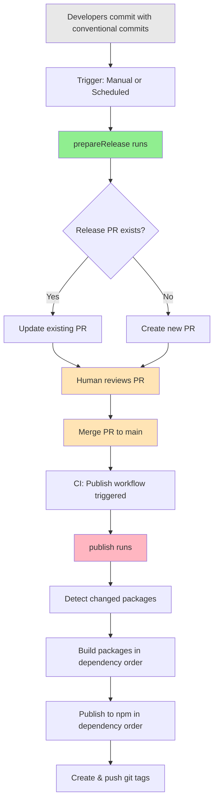
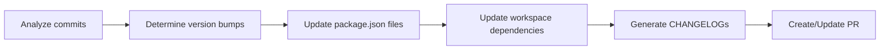
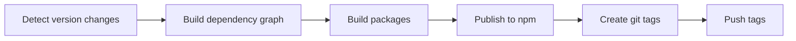

# How It Works

This document explains the release workflow used by `@ucdjs/release-scripts`.

## Overview

The release process is split into two phases:

1. **Prepare Release** - Creates/updates a release PR with version bumps and changelogs
2. **Publish** - Publishes packages to npm after the PR is merged (TODO)

This is similar to how [Changesets](https://github.com/changesets/changesets) works, but uses **conventional commits** instead of changeset files.

## Complete Workflow



**Key Points:**
- 🟢 Green: `prepareRelease` phase (creates PR)
- 🔴 Pink: `publish` phase (publishes packages) - **TODO**
- 🟡 Yellow: Human interaction required

## Phase 1: Prepare Release

### High-Level Flow



### Step-by-Step Process

#### 1. Analyze Conventional Commits

The script analyzes commits since the last release for each package:

```
feat: add new utility function     → Minor bump
fix: resolve parsing bug           → Patch bump
feat!: redesign authentication     → Major bump
docs: update README                → No bump
```

#### 2. Determine Version Bumps

Based on commit analysis, calculate the new version for each changed package:

```
@ucdjs/utils:  1.0.0 → 1.1.0  (had 'feat' commits)
@ucdjs/core:   2.3.1 → 2.3.2  (had 'fix' commits)
@ucdjs/plugin: 1.5.0 → 2.0.0  (had breaking changes)
```

#### 3. Handle Workspace Dependencies

When a package is updated, **all packages that depend on it are also updated**:

```mermaid
graph TD
    A[@ucdjs/utils<br/>v1.0.0 → v1.1.0] --> B[@ucdjs/core<br/>v2.0.0 → v2.0.1]
    A --> C[@ucdjs/plugin<br/>v1.5.0 → v1.5.1]
    B --> D[@ucdjs/cli<br/>v3.0.0 → v3.0.1]

    style A fill:#90EE90
    style B fill:#FFB6C1
    style C fill:#FFB6C1
    style D fill:#FFB6C1
```

**Legend:**
- 🟢 **Green** = Package with actual code changes (from commits)
- 🔴 **Pink** = Dependent packages (updated because dependencies changed)

**Example:**
1. `@ucdjs/utils` has new features → bump to `v1.1.0`
2. `@ucdjs/core` depends on `@ucdjs/utils` → update its dependency to `^1.1.0` → bump to `v2.0.1`
3. `@ucdjs/plugin` depends on `@ucdjs/utils` → update its dependency to `^1.1.0` → bump to `v1.5.1`
4. `@ucdjs/cli` depends on `@ucdjs/core` → update its dependency to `^2.0.1` → bump to `v3.0.1`

#### 4. Update Files

For each package, the script updates:

**package.json:**
```diff
{
  "name": "@ucdjs/core",
- "version": "2.0.0",
+ "version": "2.0.1",
  "dependencies": {
-   "@ucdjs/utils": "^1.0.0"
+   "@ucdjs/utils": "^1.1.0"
  }
}
```

**CHANGELOG.md:**
```markdown
# Changelog

## 2.0.1 (2025-01-07)

### Dependencies

- Updated @ucdjs/utils to ^1.1.0
```

#### 5. Create or Update Release PR

The script checks if a release PR already exists:

**If PR exists:**
- Update the branch with new version changes
- Update PR description with new package list

**If PR doesn't exist:**
- Create a new branch (e.g., `release/vX.Y.Z`)
- Push all changes
- Create PR with title like "Release vX.Y.Z"

### Release PR Contents

```markdown
📦 Release vX.Y.Z

## Packages

- @ucdjs/utils: 1.0.0 → 1.1.0
- @ucdjs/core: 2.0.0 → 2.0.1 (dependency update)
- @ucdjs/plugin: 1.5.0 → 1.5.1 (dependency update)
- @ucdjs/cli: 3.0.0 → 3.0.1 (dependency update)

## Changes

### @ucdjs/utils v1.1.0

#### Features
- add new utility function (#123)

#### Fixes
- handle edge case in parser (#124)

[See individual CHANGELOG.md files for full details]
```

## Phase 2: Publish (TODO)

> **Status:** Not yet implemented

After the release PR is merged to main, a GitHub Actions workflow automatically publishes the packages.

### High-Level Flow



### Step-by-Step Process

#### 1. Detect Changed Packages

When the PR is merged, the workflow detects which packages had version changes by comparing `package.json` files.

#### 2. Build Dependency Graph

Build a graph of all workspace packages and their dependencies to determine publish order.

#### 3. Calculate Publish Order (Topological Sort)

Packages must be published in **dependency order** to ensure dependents reference already-published versions.

```mermaid
graph TD
    subgraph "Level 0: Publish First"
        A[@ucdjs/utils v1.1.0]
    end

    subgraph "Level 1: Publish Second"
        B[@ucdjs/core v2.0.1]
        C[@ucdjs/plugin v1.5.1]
    end

    subgraph "Level 2: Publish Last"
        D[@ucdjs/cli v3.0.1]
    end

    A -.->|depends on| B
    A -.->|depends on| C
    B -.->|depends on| D

    style A fill:#90EE90
    style B fill:#87CEEB
    style C fill:#87CEEB
    style D fill:#DDA0DD
```

**Why this order matters:**

1. **Publish `@ucdjs/utils@1.1.0`** first ✅
2. **Publish `@ucdjs/core@2.0.1`** (references `@ucdjs/utils@^1.1.0` which now exists) ✅
3. **Publish `@ucdjs/plugin@1.5.1`** (references `@ucdjs/utils@^1.1.0` which now exists) ✅
4. **Publish `@ucdjs/cli@3.0.1`** (references `@ucdjs/core@2.0.1` which now exists) ✅

**If we published in wrong order:**

❌ Publish `@ucdjs/cli@3.0.1` first → references `@ucdjs/core@2.0.1` which doesn't exist yet → **npm install fails!**

#### 4. Build & Publish Each Package

For each package in dependency order:

1. Run build script (if exists)
2. Run `npm publish` (or `pnpm publish`)
3. Wait for publish to complete
4. Move to next package

#### 5. Create Git Tags

After all packages are successfully published, create git tags:

```bash
git tag @ucdjs/utils@1.1.0
git tag @ucdjs/core@2.0.1
git tag @ucdjs/plugin@1.5.1
git tag @ucdjs/cli@3.0.1
```

#### 6. Push Tags

```bash
git push origin --tags
```

These tags can then trigger additional workflows (like creating GitHub releases).
